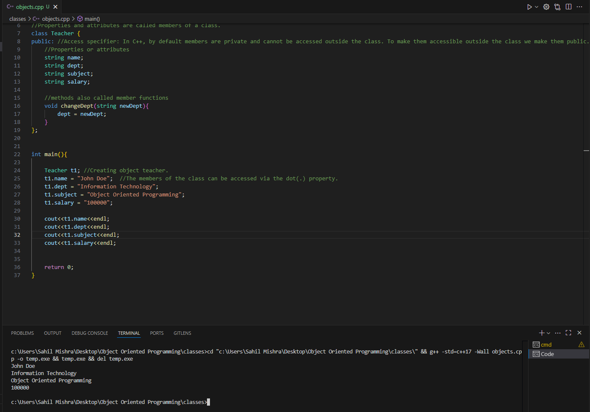
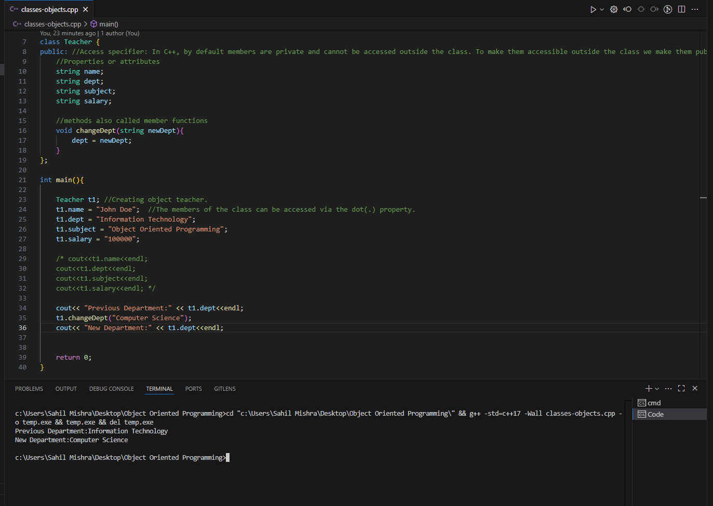
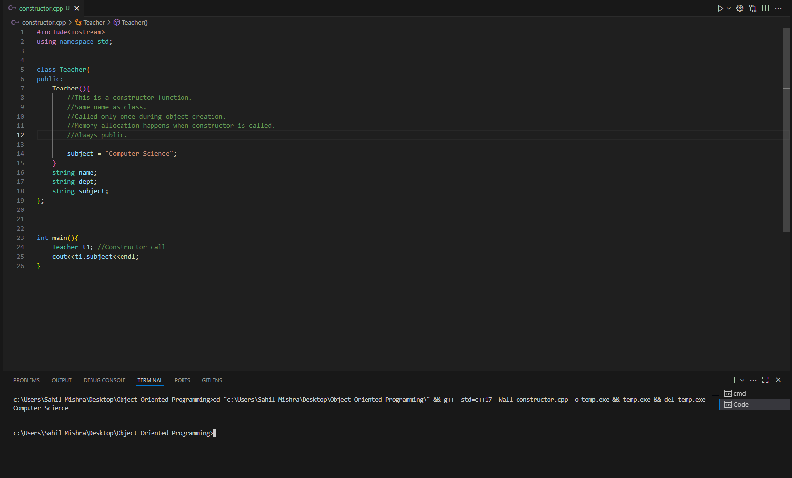

# Object-Oriented-Programming-Learning

This repository documents my journey in learning **Object-Oriented Programming (OOP)**. It includes key concepts, code examples, and illustrations focused on practical understanding of OOP principles using C++.

---

##  OOP Concepts

### 1. **Class**

A **class** is a blueprint or template for creating objects. It defines properties (attributes) and behaviors (methods) that objects will have.

####  Example: Defining and Using a Class

In this example:
- A class `Teacher` is defined with attributes like `name`, `dept`, and `subject`.
- An object `t1` is created using the class.
- Public members are accessed using the dot (`.`) operator.

>  **Note:** In C++, class members are `private` by default. To make them accessible from outside the class, they must be declared `public`.

---

### 2. **Accessing Member Functions**

In this example:
- The `changeDept()` function modifies the department value.

---

### 3. **Constructor**

A **constructor** is a special method that is automatically called when an object is created. It is used to initialize the object’s attributes and allocate memory.

####  Characteristics of Constructors:
- Has the **same name** as the class.
- Has **no return type**, not even `void`.
- Is called **automatically** during object creation.
- Usually declared `public` so it can be accessed from outside the class.
- Ensures an object starts in a valid state.

#### Example: Constructor in Action

At the time of object creation the constructor was called which initialised the value of the attribute `subject` which we were able to access in the `main` function.
